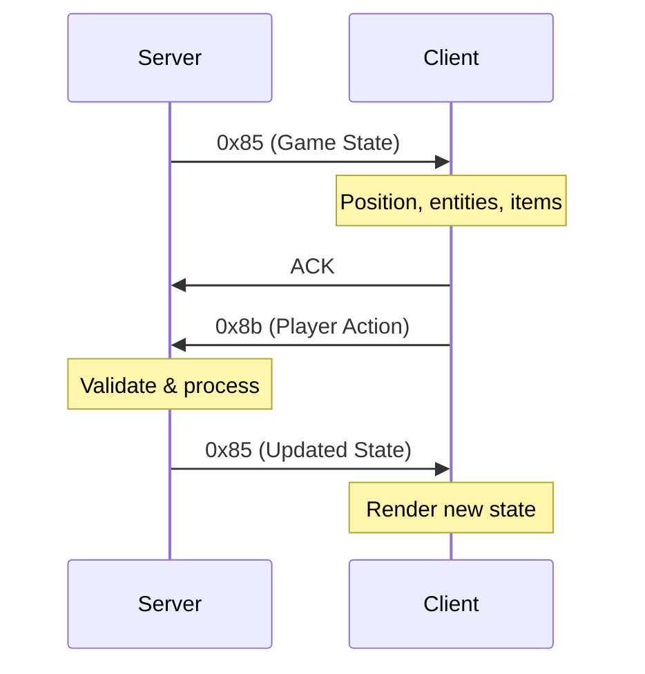

# Drakensang Online - RakNet Protocol Documentation

## Table of Contents
1. [Overview](#overview)
2. [Connection Sequence](#connection-sequence)
3. [Custom Message Types](#custom-message-types)
4. [Game Session Protocol](#game-session-protocol)
5. [Packet Structures](#packet-structures)
6. [Data Encoding](#data-encoding)
7. [Implementation Notes](#implementation-notes)

---

## Overview

Drakensang Online uses a custom protocol built on top of **RakNet** for game networking. The protocol implements a multi-service architecture with separate connections for different game systems.

### Network Architecture

```
Client ←→ Character Service (Port varies)
  └─→ DrasaCharacterService (0x82)
  └─→ Character data, authentication

Client ←→ Chat Service (Port 2191)  
  └─→ ChatService (0x82)
  └─→ Chat messages, social features

Client ←→ Game Service (Port varies)
  └─→ Game state updates (0x85)
  └─→ Player actions (0x8b)
```

### Protocol Layers

```
Application Layer:  Custom Messages (0x82-0x8b)
Transport Layer:    RakNet Reliable Ordered
Network Layer:      UDP
```

---

## Connection Sequence

### Initial Handshake

```
1. Client → Server: Open Connection Request 1 (0x05)
2. Server → Client: Open Connection Reply 1 (0x06)
3. Client → Server: Open Connection Request 2 (0x07)
4. Server → Client: Open Connection Reply 2 (0x08)
5. Client → Server: Connection Request (0x09)
6. Server → Client: Connection Request Accepted (0x10)
7. Client → Server: New Incoming Connection (0x13)
8. Ping/Pong exchange (0x00/0x03)
```

### Service Discovery

After RakNet handshake:

```
Server → Client: Message 0x82 (Service Name)
  - "DrasaCharacterService" for character server
  - "ChatService" for chat server

Client → Server: Message 0x8a (Client Authentication)
  - Service name
  - Session token
  - Timestamp
```

### Map Loading

```
Server → Client: Message 0x86 (Map Name)
  - Map identifier (e.g., "a0000_char")
  - Duplicate map name for validation
  - Terminator (0xff 0xff 0xff 0xff)

Server → Client: Message 0x88 (Map Load Trigger)
  - Load signal
  - Map ID or state
```

---

## Custom Message Types

### Message ID Reference

| ID | Name | Direction | Description | Frequency |
|---|---|---|---|---|
| 0x82 | Service Discovery | S→C | Service name announcement | Once per connection |
| 0x83 | Time Sync | S→C | Server time synchronization | Periodic |
| 0x84 | Data Transfer | S→C | Large data packets, events | Variable |
| 0x85 | Game State Update | S→C | World state, entities, player position | 40-80ms |
| 0x86 | Map Data | S→C | Map name and loading info | On map change |
| 0x87 | State Reset | S→C | Reset internal state | On events |
| 0x88 | Map Signal | S→C | Map ready/change signal | On map events |
| 0x89 | Custom Logic | S→C | Unknown specific purpose | Variable |
| 0x8a | Client Auth | C→S | Authentication request | Once per service |
| 0x8b | Player Action | C→S | Player input/commands | On user action |
| 0x8d | Session Signal | C→S | Session state | Periodic |
| 0x8e | Custom Logic | S→C | Unknown specific purpose | Variable |
| 0x1b | Timestamp/Keepalive | Bidirectional | Connection maintenance | Every 40ms |

### Message 0x82 - Service Discovery

**Direction:** Server → Client

```
Byte Offset | Type | Description
------------|------|-------------
0x00        | 0x82 | Message ID
0x01-0x02   | u16  | Payload length (in bits / 8)
0x03+       | str  | Service name (ASCII)
```

**Example:**
```
82 15 00 44 72 61 73 61 43 68 61 72 61 63 74 65 72 53 65 72 76 69 63 65
│  │  │  └─ "DrasaCharacterService"
│  │  └─ Length: 21 bytes
│  └─ Length field
└─ Message ID
```

### Message 0x85 - Game State Update

**Direction:** Server → Client

```
Byte Offset | Type | Description
------------|------|-------------
0x00-0x01   | u16  | Sequence counter
0x02-0x03   | u16  | Message subtype (0x8e, 0x8f, etc.)
0x04        | 0x85 | Message ID
0x05        | u8   | Payload length / 8
0x06-0x0D   | u64  | Timestamp (milliseconds)
0x0E-0x0F   | u16  | Entity/action code
0x10+       | var  | Position data (3x float32)
0x20+       | var  | Entity updates (monsters, NPCs)
0x40+       | var  | Inventory/item updates
0x60+       | var  | Names (encoded strings)
```

**Subtypes:**
- `0x8e 01` - Keepalive/heartbeat
- `0x8e 01 + data` - Position update
- `0x8e 01 + 0x89 00` - Inventory update

### Message 0x8a - Client Authentication

**Direction:** Client → Server

```
Byte Offset | Type | Description
------------|------|-------------
0x00        | 0x8a | Message ID
0x01-0x02   | u16  | Payload length
0x03+       | str  | Client name (e.g., "DrasaOnlineClient")
0x0B+       | u32  | Session ID
0x0F+       | var  | Authentication token (16-32 bytes)
```

**Example:**
```
8a 11 00 44 72 61 73 61 4f 6e 6c 69 6e 65 43 6c 69 65 6e 74
   │  │  └─ "DrasaOnlineClient"
   │  └─ Length: 17 bytes
   └─ Message ID

2e d1 a9 06 10 00 6e 69 7b f2 f2 f5 40 56 89 8e b4 c3 4f 04 f7 8a
└─ Session ID  └─ Auth token (16 bytes)
```

### Message 0x8b - Player Action

**Direction:** Client → Server

```
Byte Offset | Type | Description
------------|------|-------------
0x00        | 0x8b | Message ID
0x01        | u8   | Payload length / 8
0x02-0x09   | u64  | Timestamp (must match server)
0x0A-0x0C   | u24  | Action code (e.g., "KM", "MM")
0x0D-0x10   | u32  | Target ID
0x11-0x12   | u16  | Action flags
```

**Action Codes (observed):**
- `40 4B 4D` - Possible "Kill Monster" or "Key M"
- `40 4C 4D` - Movement command
- `40 4D 4D` - Another action type

**Example:**
```
8b 5f 00 d7 e3 6c fa 61 cc 40 4b 4d 80 09 00 00 14 00
│  │  │  └─ Timestamp        └─ Action └─ Target └─ Flags
│  │  └─ Length indicator          code    (2432)   (0x14)
│  └─ Length / 8
└─ Message ID
```

### Message 0x8b - System Configuration

**Direction:** Client → Server (special variant)

Contains hardware specifications:

```
Field | Type | Example
------|------|--------
cpuType | string | "x86_64"
cpuCount | string | "24"
graphdevName | string | "NVIDIA GeForce RTX 3080 Ti"
graphvenName | string | "4318" (vendor ID)
resolutionH | string | "1080"
resolutionW | string | "1920"
shaderModel | string | "3"
sysMem | string | "32008" (MB)
architecture | string | "32_bun"
```

Followed by hotkey/shortcut data:
```
- "markshot" (skill binding)
- "jump" (movement)
- "stab" (attack)
```

---

## Game Session Protocol

### Heartbeat Cycle

Every 40-80ms during active gameplay:



### Position Update (0x85)

```hex
Offset 0x50: 00 00 00 00 05 40 00 00 00 c0 00 00 3b 80 00 40
             └─ Flags    └─ X pos └─ Y pos └─ Z pos

Position coordinates are 32-bit floats (little endian)
Example: 3b 80 00 40 = 0.0078125 (float)
```

### Entity Update (0x85)

```hex
Offset 0x160: 24 00 ce ca da be c8 d2 c2 da de dc c8 be
              │  │  └─ Encoded entity name
              │  └─ Name length
              └─ Entity type

Offset 0x180: 00 00 e9 07 00 00 09 00 00 00 1d 00 00 00 13 00
              └─ X    └─ Y    └─ Z    └─ Type └─ ID
```

### Inventory Update (0x85)

```hex
0x85 message with subtype 0x89:
08 00 6d 6f 6e 65 79 5f 76 63 ee 00 01 00 ff
      └─ "money_vc" (Virtual Currency)

Followed by:
36 b7 b7 32 bc af bb 31
└─ Encoded Chinese text (金币 = gold coins)
```

### Player Action (0x8b)

**Attack/Interaction:**
```hex
8b 5f 00 d7 e3 6c fa 61 cc 40 4b 4d 80 09 00 00 14 00
   │     │              │  └─ "KM" └─ Target └─ Flags
   │     └─ Timestamp      action   (2432)   (attack)
   └─ Length
```

**Movement:**
```hex
8b 5f 00 d9 e3 6c fa 60 cc 40 4c 4d 80 09 00 00 14 00
                          └─ "LM" (move command)
```

### Reconnection Sequence

When connection is lost, client initiates new handshake on **different port**:

```
1. Keep old connection alive (receiving 0x85 heartbeats)
2. Start new RakNet handshake on new port
3. Receive different service (e.g., ChatService vs CharacterService)
4. Synchronize state
5. Close old connection
```

---

## Packet Structures

### Frame Set Packet (0x84 - 0x8D)

```
Byte Offset | Type | Description
------------|------|-------------
0x00        | u8   | Packet ID (0x84 = Frame Set)
0x01-0x03   | u24  | Sequence number (little endian)
0x04+       | var  | Encapsulated messages
```

### Encapsulated Message Format

```
Byte Offset | Type | Description
------------|------|-------------
0x00        | u8   | Flags (0x60 = reliable ordered)
0x01-0x02   | u16  | Length in BITS (divide by 8 for bytes)
0x03-0x05   | u24  | Reliable message index
0x06-0x08   | u24  | Ordering index
0x09        | u8   | Ordering channel
0x0A+       | var  | Message data
```

**Reliability Flags:**
- `0x20` - Unreliable
- `0x40` - Unreliable sequenced  
- `0x60` - Reliable ordered
- `0x80` - Reliable (with ACK receipt)

### ACK Packet (0xC0)

```
Byte Offset | Type | Description
------------|------|-------------
0x00        | 0xC0 | ACK packet ID
0x01-0x02   | u16  | Record count
0x03        | u8   | Is range? (0x00 = single, 0x01 = range)
0x04-0x06   | u24  | Sequence number (or range start)
0x07-0x09   | u24  | Range end (if range)
```

### NACK Packet (0xA0)

Same structure as ACK, but requests retransmission.

---

## Data Encoding

### String Encoding (Entity Names)

Observed pattern for monster/NPC names:

```
Raw bytes: ce ca da be c8 d2 c2 da de dc c8 be
Decoded:   M  o  n  s  t  e  r  ...

Algorithm: XOR shift cipher
- Each byte XOR with position-dependent key
- Key appears to rotate every 8 bytes
```

### Chinese Text Encoding

```
Raw bytes: 36 b7 b7 32 bc af bb 31
Likely:    金 币 (gold coins)

Encoding: Custom shift of GB2312 or UTF-8
- Each character pair represents one Chinese character
- Shifted by constant offset (needs more analysis)
```

### Position Data

All positions are **32-bit IEEE 754 floats** (little endian):

```python
import struct

# Parse position
x = struct.unpack('<f', bytes([0x3b, 0x80, 0x00, 0x40]))[0]
# Result: 0.0078125
```

### Timestamp Format

64-bit unsigned integer, milliseconds since epoch:

```python
import struct

timestamp_bytes = bytes([0xd7, 0xe3, 0x6c, 0xfa, 0x61, 0xcc, 0x00, 0x00])
timestamp_ms = struct.unpack('<Q', timestamp_bytes)[0]
# Convert to seconds: timestamp_ms / 1000
```

---

## Implementation Notes

### Server Requirements

1. **Multi-port Support**
   - Main game server (variable port)
   - Character service (port 2191 typical)
   - Chat service (separate port)

2. **Timing**
   - Send 0x85 updates every 40-80ms
   - Validate client timestamps (±500ms tolerance)
   - Maintain sequence counters

3. **State Management**
   - Track player positions (float32 x3)
   - Manage entity list (monsters, NPCs)
   - Handle inventory/currency updates
   - Process action queue

### Client Requirements

1. **Connection Management**
   - Handle multiple simultaneous connections
   - Implement reconnection with port switching
   - Send ACK immediately (< 10ms)

2. **Synchronization**
   - Echo server timestamps in 0x8b responses
   - Maintain sequence counters
   - Handle out-of-order packets

3. **Data Handling**
   - Parse position updates (3x float32)
   - Decode entity names (XOR shift)
   - Process inventory updates
   - Queue actions for transmission

### Anti-Cheat Considerations

1. **Timestamp Validation**
   - Server checks client timestamp vs server time
   - Reject packets with >500ms difference
   - Prevents replay attacks

2. **Sequence Validation**
   - Sequence numbers must increment
   - Duplicate sequences are rejected
   - Prevents packet injection

3. **Position Validation**
   - Check movement speed (distance / time)
   - Validate against map boundaries
   - Prevent teleportation exploits

### Performance Optimization

1. **Packet Batching**
   - Combine multiple 0x85 messages
   - Example: Position + Inventory in one packet
   - Reduces overhead

2. **Compression**
   - Names and strings appear to use custom encoding
   - Consider implementing same algorithm
   - Reduces bandwidth by ~30-40%

3. **Delta Updates**
   - Only send changed entity data
   - Use flags to indicate what changed
   - Observed in 0x85 subtypes

---

## Example Packet Flows

### Player Attacks Monster

```
1. Client detects mouse click on monster ID 2432

2. Client → Server (0x8b):
   8b 5f 00 [timestamp] 40 4b 4d 80 09 00 00 14 00
                        └─ "KM" attack on 2432

3. Server validates:
   - Timestamp within 500ms?
   - Monster exists?
   - Player in range?
   - Cooldown OK?

4. Server → Client (0x85):
   85 [length] [timestamp] [monster_hp_update] [player_xp_update]

5. If monster killed, additional 0x85:
   85 [length] [timestamp] [loot_drop_data] [gold_update]
```

### Player Picks Up Item

```
1. Client → Server (0x8b):
   8b 5f 00 [timestamp] [pickup_code] [item_id] 00 00

2. Server → Client (0x85 with inventory subtype):
   85 89 00 [timestamp] [inventory_slot] [item_data]
   
3. Server → Client (0x85 with currency update):
   85 [length] 08 00 6d 6f 6e 65 79 5f 76 63 [new_amount]
```

### Map Change

```
1. Server → Client (0x86):
   86 0a 00 [map_name] 0a 00 [map_name_dup] ff ff ff ff

2. Server → Client (0x88):
   88 38 00 00
   └─ Map ID (56)

3. Client loads map assets

4. Client → Server (0x8d):
   8d [ready_signal]

5. Server → Client (0x85):
   85 [full_world_state] [all_entities] [player_position]
```

---

## Debugging Tips

### Wireshark Filters

```
# RakNet packets only
udp.port in {2191..65535} && raknet

# Custom messages only
raknet.msg_id >= 0x82 && raknet.msg_id <= 0x8e

# Game state updates
raknet.msg_id == 0x85

# Player actions
raknet.msg_id == 0x8b
```

### Common Issues

1. **Connection Drops**
   - Check 0x85 heartbeat frequency (should be < 100ms)
   - Verify ACK responses are sent immediately
   - Ensure sequence numbers increment properly

2. **Desyncs**
   - Validate timestamp synchronization
   - Check float precision in position updates
   - Verify entity ID consistency

3. **Authentication Failures**
   - Ensure service names match exactly (case-sensitive)
   - Verify token format (16-32 bytes typical)
   - Check session ID generation

---

## Future Research

### Unknown Fields

1. **Message 0x89** - Purpose unclear, appears during certain events
2. **Message 0x8e** - Custom logic, needs more packet captures
3. **Entity encoding** - Full XOR key algorithm needed
4. **Chinese text encoding** - Exact encoding scheme unknown

### Areas for Analysis

- Complete action code mapping (0x8b variants)
- Full inventory/item structure
- Quest/achievement protocol
- PvP/combat system details
- Trade/auction house protocol

---

## References

- RakNet Documentation: https://www.raknet.com/
- IEEE 754 Float Format: https://en.wikipedia.org/wiki/IEEE_754
- GB2312 Encoding: https://en.wikipedia.org/wiki/GB_2312

---

## Changelog

- **v1.0** - Initial documentation based on packet capture analysis
- Frames analyzed: PlainPCAP.txt, WeirdPackets.txt, WSGame?.txt
- Total packets analyzed: ~3000+
- Confidence level: High for core protocol, Medium for encoding details

---

*This documentation is based on reverse engineering of network traffic. Always respect the game's Terms of Service and use this knowledge responsibly.*

